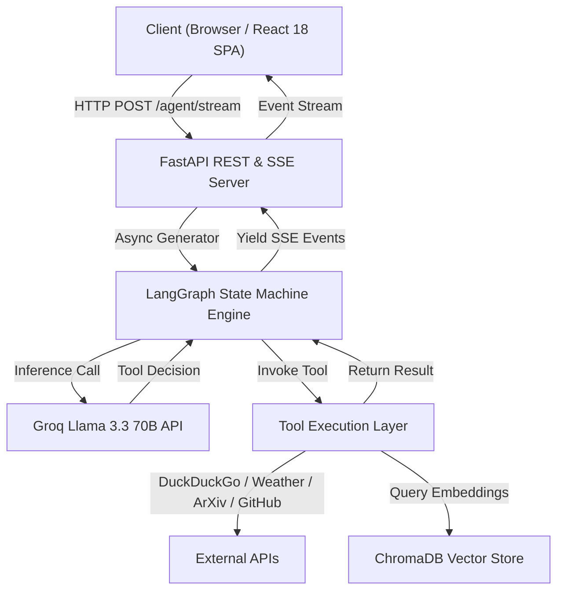
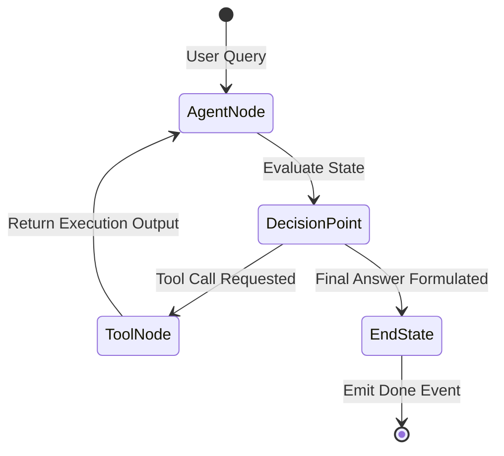

# System Architecture & Technical Deep-Dive

This document details the architectural design, component interactions, state machine flows, and protocol specifications of the **AI Research Assistant**.

---

## 🏛️ System Overview

The AI Research Assistant is engineered as a decoupled, event-driven web application comprising a high-performance **React 18 Single-Page Application (SPA)** and a **FastAPI + LangGraph** backend server.



---

## 🔁 LangGraph Agent Flow State Machine

The backend agent state machine is built using **LangGraph**. The execution flow follows a cyclic state transition until the LLM decides no further tools are required.



---

## 📡 Server-Sent Events (SSE) Streaming Protocol

The client communicates with the server via `POST /agent/stream`. The response is served with header `Content-Type: text/event-stream`.

### Event Payload Schema:

1. **`thinking`**:
   ```json
   event: thinking
   data: {"message": "Analyzing query and checking tools..."}
   ```
2. **`tool_start`**:
   ```json
   event: tool_start
   data: {"tool": "weather", "input": {"location": "Tokyo"}}
   ```
3. **`tool_result`**:
   ```json
   event: tool_result
   data: {"tool": "weather", "output": {"temperature": "22°C", "condition": "Sunny"}, "execution_time_ms": 142.5}
   ```
4. **`response`**:
   ```json
   event: response
   data: {"content": "The weather in Tokyo is currently 22°C and sunny."}
   ```
5. **`done`**:
   ```json
   event: done
   data: {"iterations": 2, "execution_time_seconds": 1.45, "tool_calls": [...]}
   ```

---

## 🎨 Design System & Theme Engine

The frontend implements a unified design system utilizing:
- **Tailwind CSS v3**: HSL color tokens and custom animation keyframes.
- **Zustand State Store**: Synchronizes application settings and Theme state (`light` vs `dark`) to `document.documentElement` class list and `localStorage`.
- **Framer Motion**: Smooth page transitions and layout animations.
