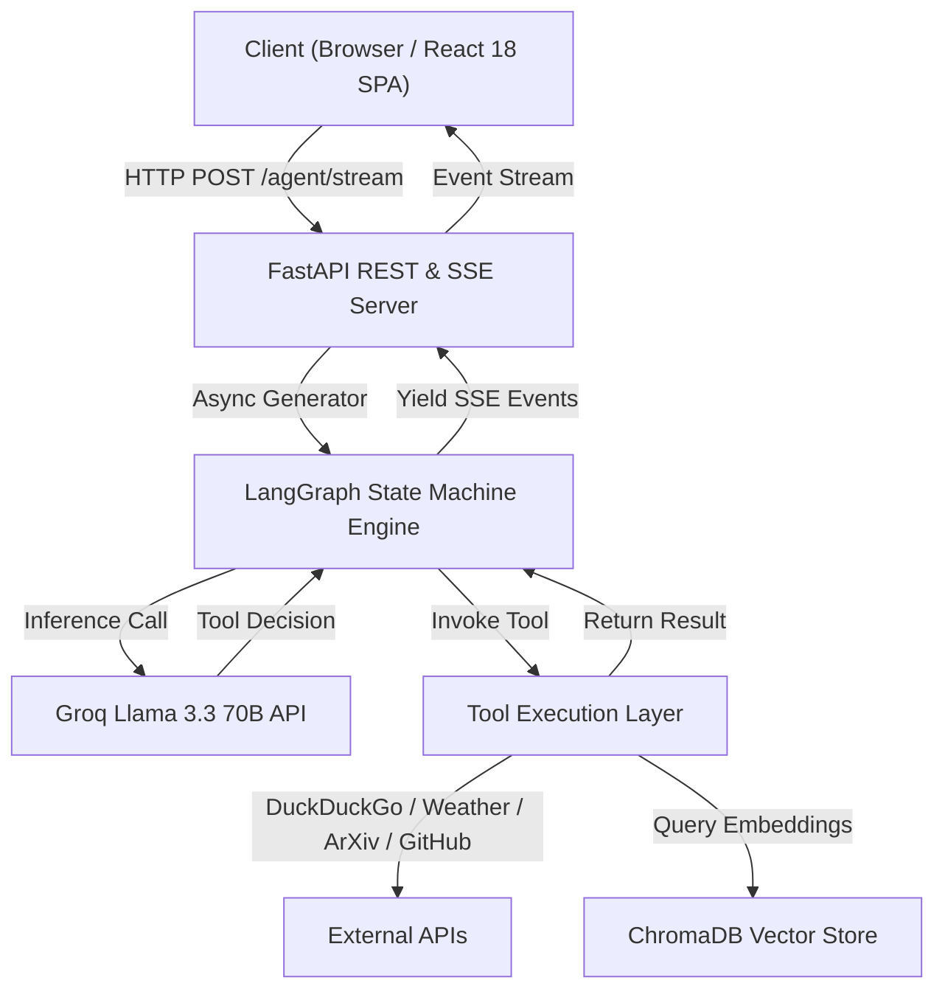

# 🧠 AI Research Assistant

[](https://github.com/Shreya71703/Research-Assistant/actions/workflows/ci.yml)
[](https://opensource.org/licenses/MIT)
[](https://www.python.org/)
[](https://reactjs.org/)
[](https://www.typescriptlang.org/)
[](https://fastapi.tiangolo.com/)
[](https://langchain-ai.github.io/langgraph/)
[](https://groq.com/)
[](https://www.docker.com/)
[](https://research-assistant-delta-brown.vercel.app)
[](https://research-assistant-api.onrender.com)

> An autonomous, multi-tool AI Research Assistant platform engineered with **React 18, TypeScript, Tailwind CSS**, and a **FastAPI + LangGraph + Groq Llama 3.3 70B** engine.

[Live Demo](https://research-assistant-delta-brown.vercel.app) · [API Documentation](API_REFERENCE.md) · [System Architecture](ARCHITECTURE.md) · [Deployment Guide](DEPLOYMENT.md)

---

## 📌 Project Overview

### What Problem It Solves
Modern research workflows require switching between search engines, academic preprint aggregators, code repositories, weather telemetry, and computational calculators. Traditional LLM interfaces lack real-time tool orchestration and event-driven transparency. 

The **AI Research Assistant** solves this by uniting an autonomous **LangGraph multi-tool agent** with a real-time **Server-Sent Events (SSE)** streaming engine and a 9-module React SaaS platform.

### Key Capabilities
- ⚡ **Sub-second Inference**: Powered by Groq Llama 3.3 70B for near-instant reasoning.
- 🤖 **Multi-Tool Orchestration**: Autonomous state machine routing queries across 7 integrated tools (`web_search`, `weather`, `news`, `math`, `arxiv`, `github`, `wikipedia`).
- 📡 **Real-time SSE Streaming**: Event-driven client updates for `thinking`, `tool_start`, `tool_result`, `response`, and `done`.
- 🌙 **System-Independent Theme Engine**: Crisp light and deep dark modes with local storage state persistence.

---

## 🎨 Feature Showcase

| Feature Module | Description |
|---|---|
| 📊 **Dashboard** | 4 real-time telemetry cards, Recharts activity area chart, platform status indicators. |
| 💬 **Research Workspace** | 3-panel chat workspace with collapsible history sidebar, live streaming thread, and citations timeline. |
| 📋 **Projects Board** | Interactive Kanban board with research task cards, category tags, and progress tracking. |
| 📁 **Documents Hub** | Multi-format file upload dropzone with format filtering (`pdf`, `docx`, `markdown`, `csv`). |
| 🗄️ **Knowledge Base** | Vector DB telemetry cards (chunks, embeddings, recall metrics) and semantic search tools. |
| 📝 **Reports Briefing** | Executive briefing report generator with export triggers. |
| 📈 **Analytics Engine** | Token consumption charts, tool execution bar charts, and latency metrics. |
| 🧩 **Integrations Manager** | Individual agent tool enable/disable toggles with live status indicators. |
| ⚙️ **Settings & Preferences** | User profile configuration and Light/Dark mode switcher cards. |

---

## 🏛️ System Architecture



---

## 🛠️ Tech Stack Matrix

| Category | Technologies |
|---|---|
| **Frontend** | React 18, Vite 5, TypeScript 5.5, Tailwind CSS 3, shadcn/ui, Framer Motion, TanStack Query, Zustand 4, React Router 6, cmdk |
| **Backend** | Python 3.11+, FastAPI 0.104, Uvicorn, Gunicorn, Pydantic v2, sse-starlette |
| **AI & Agentic Framework** | LangGraph 0.2, LangChain 0.3, Groq Llama 3.3 70B Versatile |
| **Data & Storage** | ChromaDB Vector Database, Neon Serverless PostgreSQL |
| **Deployment & Infra** | Vercel Global Edge Network, Render Free Web Service, Docker, GitHub Actions |

---

## 📂 Project Structure

```
.
├── .github/workflows/ci.yml # GitHub Actions CI pipeline
├── agent/                  # LangGraph Agent Core
│   ├── graph.py            # State Machine & Event Generator
│   ├── tools.py            # 7 Integrated Research Tools
│   └── schemas.py          # Pydantic State Schemas
├── api/                    # FastAPI Server & Routes
│   ├── server.py           # Application Entry & CORS Settings
│   ├── routes.py           # REST & Streaming Endpoints
│   └── static/             # Compiled Production React Build
├── frontend/               # React 18 TypeScript SPA
│   ├── src/
│   │   ├── components/    # Layout, UI Primitives & Command Palette
│   │   ├── pages/         # 9 Full Interactive Application Pages
│   │   ├── stores/        # Zustand State Stores (chatStore, uiStore)
│   │   ├── lib/           # API Client & Utilities
│   │   └── types/         # TypeScript Interface Definitions
│   ├── package.json
│   ├── tailwind.config.ts
│   └── vercel.json        # Vercel Production Configuration
├── render.yaml             # Render Blueprint Spec
├── Dockerfile              # Container Manifest
└── requirements.txt        # Python Dependencies
```

---

## 💻 Installation & Local Development

### 1. Clone Repository
```bash
git clone https://github.com/Shreya71703/Research-Assistant.git
cd Research-Assistant
```

### 2. Backend Setup
```bash
python -m venv venv
source venv/bin/activate  # On Windows: .\venv\Scripts\activate
pip install -r requirements.txt
cp .env.example .env
# Set your GROQ_API_KEY in .env
python -m uvicorn api.server:app --reload --port 8000
```

### 3. Frontend Setup
```bash
cd frontend
npm install
npm run dev
```
Open **[http://localhost:5173](http://localhost:5173)** in your browser.

---

## 🔐 Environment Variables

| Variable | Scope | Required | Description |
|---|---|---|---|
| `GROQ_API_KEY` | Backend | **Yes** | API key for Llama 3.3 70B inference ([console.groq.com](https://console.groq.com)) |
| `VITE_API_URL` | Frontend | **Yes** | Backend URL (`https://research-assistant-api.onrender.com` in prod) |
| `CORS_ORIGINS` | Backend | **Yes** | Allowed CORS origins separated by commas |
| `ENVIRONMENT` | Backend | No | Execution environment (`production` / `development`) |
| `LOG_LEVEL` | Backend | No | Logging level (`INFO` / `DEBUG`) |
| `CHROMA_DB_PATH` | Backend | No | Vector database persistent storage path (`./agent/chroma_db`) |

---

## 📡 API Reference Summary

| Method | Endpoint | Description |
|---|---|---|
| `GET` | `/health` | Instant health check & telemetry return |
| `POST` | `/agent/query` | Synchronous batch query execution |
| `POST` | `/agent/stream` | Server-Sent Events (SSE) streaming query execution |

For complete payloads and curl examples, see [API_REFERENCE.md](API_REFERENCE.md).

---

## 📸 Interactive Application Modules

The application features 9 interactive workspace modules accessible from the universal navigation sidebar:

| Module | Features & Capabilities |
|---|---|
| 📊 **Dashboard** | Hero welcome greeting, 4 floating telemetry cards, interactive Recharts weekly research activity area chart, quick query prompt chips, live API & engine health status indicators. |
| 💬 **Research Workspace** | 3-panel research environment with collapsible conversation history sidebar, center message thread with real-time SSE streaming, syntax-highlighted code blocks, animated tool execution cards, and right panel with extracted sources timeline. |
| 📋 **Projects Kanban** | Interactive project board with status columns (`Planning`, `In Progress`, `Under Review`, `Completed`), category tags, progress bars, and category filter chips. |
| 📁 **Documents Workspace** | Multi-format file upload dropzone supporting PDF, DOCX, Markdown, and CSV file formats with search and view toggles. |
| 🗄️ **Knowledge Base** | Vector database telemetry metrics (total chunks, embedding count, recall rate), collection indices, and semantic search testing tool. |
| 📝 **Reports Generator** | Executive briefing report generator with one-click export triggers for PDF, Markdown, and DOCX briefing formats. |
| 📈 **Analytics Telemetry** | Token consumption charts, tool execution distribution bar charts, and computational hours saved statistics. |
| 🧩 **Tool Integrations** | Agent tool configuration manager with individual enable/disable toggle switches for Web Search, Weather, ArXiv, GitHub, and Calculator tools. |
| ⚙️ **Settings & Themes** | User profile settings, API key configurations, keyboard shortcut reference, and system-independent Light / Dark theme selector. |

---

## 🚀 100% Free Production Deployment

Deploys for **$0/month** without entering a credit card:

1. **Backend (Render)**: Connect repo to Render.com → Select `Python` → Build: `pip install -r requirements.txt` → Start: `python -m uvicorn api.server:app --host 0.0.0.0 --port $PORT`.
2. **Frontend (Vercel)**: Import repo to Vercel.com → Framework: `Vite` → Root Directory: `frontend` → Set `VITE_API_URL=https://research-assistant-api.onrender.com`.

For full step-by-step instructions, view [DEPLOYMENT.md](DEPLOYMENT.md).

---

## 🗺️ Roadmap & Contributing

- View our planned feature milestones in [ROADMAP.md](ROADMAP.md).
- Interested in contributing? Read [CONTRIBUTING.md](CONTRIBUTING.md) and [CODE_OF_CONDUCT.md](CODE_OF_CONDUCT.md).

---

## 📜 License

This project is licensed under the [MIT License](LICENSE).
